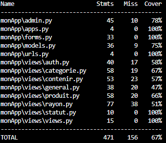

# Tuto Django

Baptiste RICHARD

## Commandes Utiles

Création du virtualenv:
`virtualenv ~/venv`

Lancement du virtualenv:
`source ~/venv/bin/activate`

Installation des dépendances:
`pip install -r requirements.txt`

## Suivi de la progression

- 11/09/2025 - Fin du TD 2
- 16/09/2025 - TD 3 page 4
- 18/09/2025 - TD 3 page 13
- 23/09/2025 - Fin du TD 3, passage a la feuille 1 TP 3
- 25/09/2025 - Fin du TP 3, todo : faire le tp mais pour rayons, categories...
- 30/09/2025 - Fin du TP 3, todo fait sauf pour statuts passage au TD4
- 7/10/2025 - TD4 page 9 :
  - Améliorations ergonomiques
  - Histoire de performances
  - Un peu de décoration
  - Barre de recherche
- 9/10/2025 - Fin TD4 & Debut TP 4:
  - Ajout Exercice récapitulatif
- 14/10/2025 - TP 4 tests:
  - Tester les modèles
  - Tester les formulaires
  - Tester les URLs
  - Tester les vues
- 15/10/2025 (Travail maison 1h30) - TP 4 fin:
  - Taux de couverture de test
  - Réorganisation des views
  - Routes sécurisées
- 16/10/202 - TD 5:
  - Serializers et APIViews
  - ModelViewSet et routeur

## Coverage de l'application

